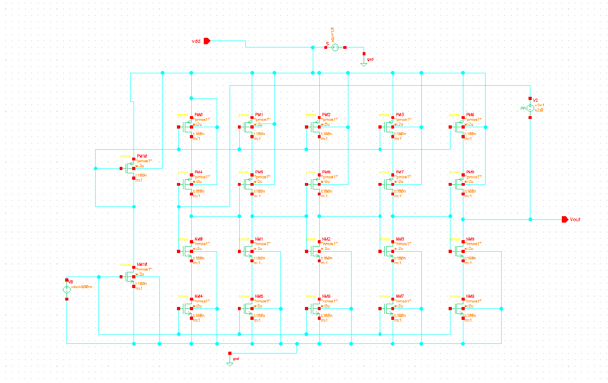
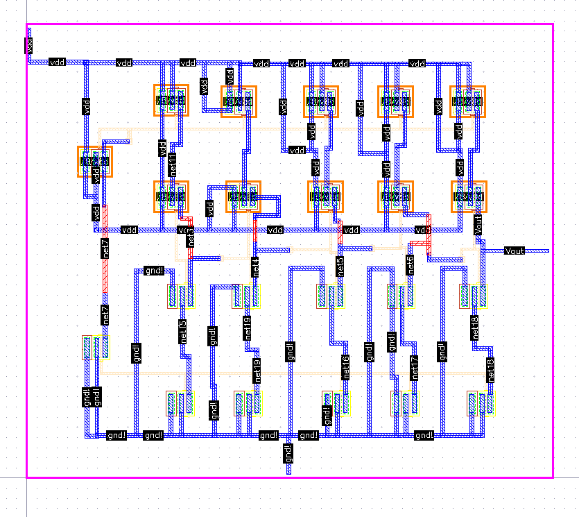
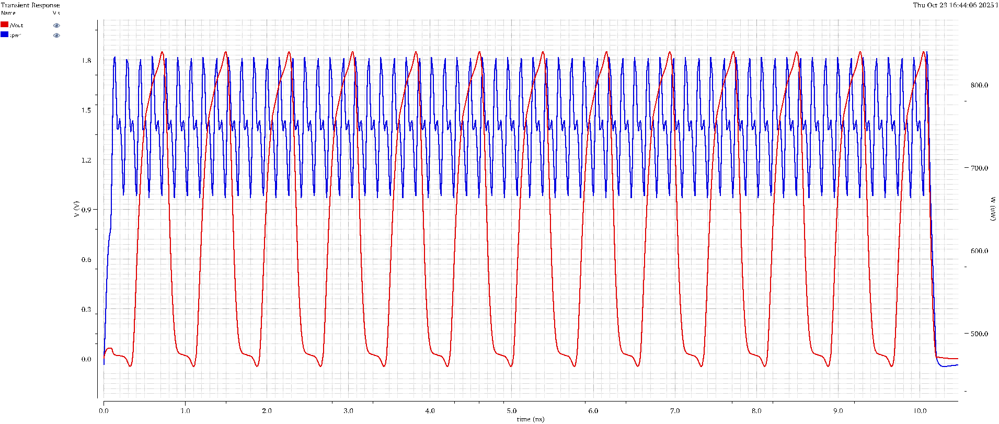

# VCO Oscillator Design (180 nm CMOS)

## Overview
This project presents the design, simulation, and layout of a Voltage-Controlled Oscillator (VCO) implemented in 180 nm CMOS technology using Cadence Virtuoso.

## Key Specifications
| Parameter              | Value                     |
|------------------------|---------------------------|
| Technology             | 180 nm CMOS               |
| Supply Voltage (VDD)   | 1.8 V                     |
| Number of Stages       | 5                         |
| Control Voltage Range  | 0.3 V - 1.5 V             |
| Frequency Range        | 500 MHz - 2.5 GHz         |
| Power Consumption      | 0.5 mW @ 1.8 GHz          |

## Circuit Schematic

### Architecture Description
- **Topology**: Current-starved ring oscillator
- **Stages**: 5 inverter stages for 180° phase shift
- **Control**: Vctrl adjusts current in starved transistors
- **Output**: Buffered differential outputs

### Key Components
- **MP1-MP5**: PMOS current starving transistors (W=2μ, L=180n)
- **MN1-MN5**: NMOS current starving transistors (W=1μ, L=180n)  
- **MP11-MP15**: PMOS inverter transistors (W=5μ, L=180n)
- **MN11-MN15**: NMOS inverter transistors (W=2μ, L=180n)
- **Output Buffer**: Enhanced drive strength inverters

## Repository Structure
- [`schematic/`](schematic/) - Circuit schematics and netlists
- [`simulations/`](simulations/) - Simulation results and scripts
- [`docs/`](docs/) - Design documentation and specifications
- [`layout/`](layout/) - Layout files and screenshots

## Design Features
- Current-starved ring oscillator topology
- 5-stage differential design
- Wide tuning range (500 MHz - 2.5 GHz)
- Low power consumption

## Documentation
- [Design Specifications](docs/design_specifications.md)
- [Simulation Data](simulations/vco_output_data.csv)

## Quick Start
1. Open schematic files in `schematic/` folder
2. Run simulation scripts from `simulations/scripts/`
3. View layout files in `layout/` folder
4. 
### Layout

## Simulation Results

### Transient Analysis

### Frequency vs Control Voltage

## Author
**Manojkumar86390**  
VLSI Design Engineer

